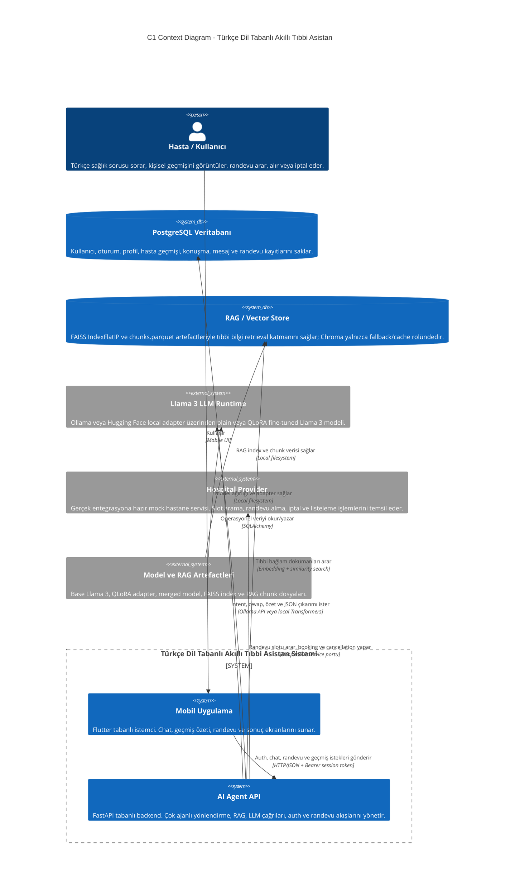
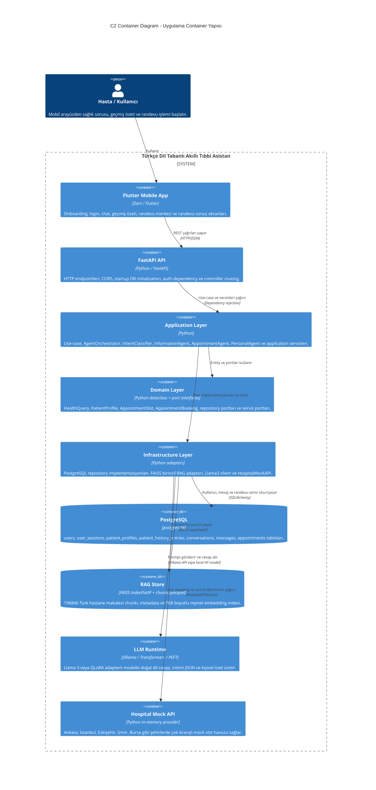

# 2.7 C4-Based Architectural Modeling

Bu bölüm, projedeki gerçek kod yapısı temel alınarak hazırlanmıştır. Diyagramlarda kullanılan bileşenler `frontend/lib` ve `backend/src` altındaki mevcut sınıf, controller, use-case, agent, repository ve adapter yapılarıyla eşleştirilmiştir.

## C1 Context Diagram

Bu seviye sistemin dış dünyayla ilişkisini gösterir. Kullanıcı mobil uygulama üzerinden sisteme erişir; backend ise operasyonel veri için PostgreSQL, tıbbi bilgi getirme için RAG/vector store, cevap üretimi için Llama 3 tabanlı LLM runtime ve randevu işlemleri için hospital provider adapterı ile konuşur.

Kod karşılığı:

- Mobil uygulama giriş noktası: `frontend/lib/main.dart`
- HTTP istemcisi: `frontend/lib/data/datasources/remote/fastapi_client.dart`
- Backend uygulama giriş noktası: `backend/src/main.py`
- API controller katmanı: `backend/src/presentation/api/controllers`
- LLM adapterı: `backend/src/infrastructure/ai/llama3_qlora_client.py`
- RAG adapterı: `backend/src/infrastructure/database/vector/faiss_chroma_db.py`
- PostgreSQL modelleri: `backend/src/infrastructure/database/postgres/models.py`

## C2 Container Diagram

Bu seviye uygulamanın ana çalıştırılabilir parçalarını ve veri depolarını gösterir. Flutter frontend yalnızca backend API ile konuşur. Backend içinde presentation, application, domain ve infrastructure katmanları ayrılmıştır.

Container kod karşılığı:

- `Flutter Mobile App`: `frontend/lib/presentation/screens`, `frontend/lib/presentation/blocs/chat_bloc.dart`
- `FastAPI API`: `backend/src/main.py`, `backend/src/presentation/api/controllers`
- `Application Layer`: `backend/src/application`
- `Domain Layer`: `backend/src/domain`
- `Infrastructure Layer`: `backend/src/infrastructure`
- `PostgreSQL`: `docker-compose.yml`, `backend/src/infrastructure/database/postgres`
- `RAG Store`: `backend/data/rag`, `backend/src/infrastructure/database/vector/faiss_chroma_db.py`
- `LLM Runtime`: `backend/src/infrastructure/ai/llama3_qlora_client.py`
- `Hospital Mock API`: `backend/src/infrastructure/external_api/hospital_mock_api.py`

## C3 Backend Component Diagram

Bu seviye backend içindeki controller, use-case, orchestrator, agent, service ve infrastructure adapter ilişkilerini gösterir. Projede ana akış `ChatController -> ProcessMedicalQueryUseCase -> AgentOrchestrator -> Agent` zinciridir.

```mermaid
C4Component
    title C3 Backend Component Diagram - FastAPI, Agentlar ve Adapterlar

    Container_Boundary(backend, "AI Agent API / backend/src") {
        Component(auth_controller, "AuthController", "FastAPI Router", "POST /auth/login, POST /auth/register, POST /auth/logout, GET /auth/me endpointlerini sağlar.")
        Component(chat_controller, "ChatController", "FastAPI Router", "POST /chat endpointiyle mesajları alır, GET /health ile servis durumunu döner.")
        Component(appointment_controller, "AppointmentController", "FastAPI Router", "GET /appointments, POST /appointments/search, book ve cancel endpointlerini sağlar.")
        Component(dependencies, "Dependency Provider", "presentation/dependencies.py", "LLM, vector DB, repositories, services, agents ve use-case nesnelerini bağlar.")

        Component(auth_service, "AuthService", "Application Service", "E-posta/şifre doğrulama, register, session oluşturma, logout ve current user çözümleme.")
        Component(process_query, "ProcessMedicalQueryUseCase", "Application Use Case", "Conversation oluşturur, HealthQuery üretir, orchestrator sonucunu kaydeder ve ChatResponse döner.")
        Component(orchestrator, "AgentOrchestrator", "Application Component", "Intent sonucuna göre Bilgi Ajanı, Randevu Ajanı veya Kişisel Geçmiş Ajanı seçer.")
        Component(intent_classifier, "IntentClassifier", "Rule + LLM Classifier", "information, appointment ve personal_history intent kararını verir.")

        Component(info_agent, "Bilgi Ajanı", "InformationAgent", "RAG dokümanları, semptom rehberi ve LLM cevabıyla kaynaklı tıbbi bilgi üretir.")
        Component(appointment_agent, "Randevu Ajanı", "AppointmentAgent", "Randevu tercihi çıkarır, slot arar, booking, cancel ve list aksiyonlarını yönetir.")
        Component(personal_agent, "Kişisel Geçmiş Ajanı", "PersonalAgent", "Profil, klinik geçmiş, randevu ve son mesaj kayıtlarından kişisel özet üretir.")

        Component(rag_service, "RAGService", "Application Service", "Vector sonuçlarını minimum skor ve token overlap ile yeniden sıralar.")
        Component(symptom_guidance, "SymptomGuidanceService", "Application Service", "Semptomlardan uzmanlık alanı, alternatif branş ve kırmızı bayrak ipuçları çıkarır.")
        Component(appointment_service, "AppointmentService", "Application Service", "Slot arama, fallback arama, slot seçimi, booking ve cancellation iş kurallarını uygular.")

        Component(auth_repo, "PostgresAuthRepository", "Infrastructure Adapter", "users ve user_sessions tabloları üzerinden auth işlemlerini yapar.")
        Component(history_repo, "PostgresUserHistoryRepository", "Infrastructure Adapter", "patient_profiles, patient_history_entries, conversations ve messages tablolarını yönetir.")
        Component(appointment_repo, "PostgresAppointmentRepository", "Infrastructure Adapter", "appointments tablosu üzerinden randevu kayıtlarını yönetir.")
        Component(vector_adapter, "ChromaVectorDBService", "Infrastructure Adapter", "Rapor artefactleriyle FAISS IndexFlatIP araması yapar; Chroma yalnızca fallback/cache olarak kullanılır.")
        Component(llm_client, "Llama3QLoRAClient", "Infrastructure Adapter", "Ollama, hf_local veya hf_adapter providerlarıyla LLMEngine portunu uygular.")
        Component(hospital_api, "HospitalMockAPI", "Infrastructure Adapter", "Gerçekçi mock hastane slotları, booking ve cancellation state'i sağlar.")
    }

    ContainerDb(postgres, "PostgreSQL", "Operational DB", "users, sessions, profiles, history, conversations, messages, appointments")
    ContainerDb(vector_store, "Vector DB / RAG Artefactleri", "FAISS IndexFlatIP + chunks.parquet", "Tıbbi makale chunkları ve 768 boyutlu mpnet embedding indexi")
    System_Ext(llm_runtime, "LLM Runtime", "Llama 3 / QLoRA", "Metin cevabı ve yapılandırılmış JSON üretimi")
    System_Ext(hospital_provider, "Hospital Provider Boundary", "Mock / future external API", "Randevu slot ve booking işlemleri")

    Rel(auth_controller, auth_service, "Login/register/logout için çağırır")
    Rel(chat_controller, process_query, "Chat mesajını use-case'e iletir")
    Rel(appointment_controller, appointment_service, "Direkt randevu endpointleri için çağırır")
    Rel(dependencies, auth_controller, "Depends ile bağlar")
    Rel(dependencies, chat_controller, "Depends ile bağlar")
    Rel(dependencies, appointment_controller, "Depends ile bağlar")

    Rel(auth_service, auth_repo, "AuthRepository portu")
    Rel(auth_repo, postgres, "users ve user_sessions okur/yazar")

    Rel(process_query, history_repo, "Conversation oluşturur ve interaction kaydeder")
    Rel(process_query, orchestrator, "HealthQuery route eder")
    Rel(history_repo, postgres, "profiles, history, conversations, messages okur/yazar")

    Rel(orchestrator, intent_classifier, "Intent sınıflandırması ister")
    Rel(orchestrator, info_agent, "information intent")
    Rel(orchestrator, appointment_agent, "appointment intent")
    Rel(orchestrator, personal_agent, "personal_history intent")

    Rel(intent_classifier, history_repo, "Yakın konuşma bağlamı okur")
    Rel(intent_classifier, llm_client, "Belirsiz intent için structured JSON ister")
    Rel(llm_client, llm_runtime, "Prompt gönderir")

    Rel(info_agent, rag_service, "retrieve(query)")
    Rel(info_agent, symptom_guidance, "Uzmanlık ve risk ipucu alır")
    Rel(info_agent, history_repo, "Yakın konuşma bağlamı okur")
    Rel(info_agent, llm_client, "Kaynaklı Türkçe bilgi cevabı üretir")
    Rel(rag_service, vector_adapter, "similarity_search")
    Rel(vector_adapter, vector_store, "index.faiss ve chunks.parquet okur")

    Rel(appointment_agent, appointment_service, "Randevu arama, alma, iptal, listeleme")
    Rel(appointment_agent, history_repo, "Profil ve son mesajları okur")
    Rel(appointment_agent, symptom_guidance, "Semptoma göre branş çıkarır")
    Rel(appointment_agent, llm_client, "Randevu parametrelerini JSON çıkarır")
    Rel(appointment_service, appointment_repo, "Kalıcı randevu state'i")
    Rel(appointment_service, hospital_api, "Mock slot ve booking işlemleri")
    Rel(appointment_repo, postgres, "appointments okur/yazar")
    Rel(hospital_api, hospital_provider, "Provider boundary")

    Rel(personal_agent, history_repo, "Profil, history ve son mesajları okur")
    Rel(personal_agent, appointment_repo, "Randevu kayıtlarını okur")
    Rel(personal_agent, llm_client, "Kişisel özet ve yakın sohbet özeti üretir")
```

Backend component kod karşılığı:

- `AuthController`: `backend/src/presentation/api/controllers/auth_controller.py`
- `ChatController`: `backend/src/presentation/api/controllers/chat_controller.py`
- `AppointmentController`: `backend/src/presentation/api/controllers/appointment_controller.py`
- `ProcessMedicalQueryUseCase`: `backend/src/application/use_cases/process_medical_query.py`
- `AgentOrchestrator`: `backend/src/application/orchestrator/agent_orchestrator.py`
- `IntentClassifier`: `backend/src/application/services/intent_classifier.py`
- `InformationAgent`: `backend/src/application/agents/information_agent.py`
- `AppointmentAgent`: `backend/src/application/agents/appointment_agent.py`
- `PersonalAgent`: `backend/src/application/agents/personal_agent.py`
- `PostgreSQL repositories`: `backend/src/infrastructure/database/postgres`
- `Vector adapter`: `backend/src/infrastructure/database/vector/faiss_chroma_db.py`
- `LLM adapter`: `backend/src/infrastructure/ai/llama3_qlora_client.py`

## C4 Code / Workflow Diagram

Bu seviye, kodun çalışma zamanındaki ana mesaj işleme akışını gösterir. Diyagram özellikle `POST /api/v1/chat` çağrısından sonra hangi sınıf/metodların devreye girdiğini ve agent seçiminin nasıl yapıldığını açıklar.

```mermaid
sequenceDiagram
    autonumber

    actor User as Hasta / Kullanıcı
    participant ChatScreen as ChatScreen._sendMessage()
    participant ChatBloc as ChatBloc.sendMessage()
    participant Repo as ChatRepositoryImpl.sendMessage()
    participant Client as FastApiClient.sendMessage()
    participant ChatAPI as ChatController.chat_endpoint()
    participant AuthDep as get_current_user()
    participant AuthRepo as PostgresAuthRepository
    participant UseCase as ProcessMedicalQueryUseCase.execute()
    participant HistoryRepo as PostgresUserHistoryRepository
    participant Orchestrator as AgentOrchestrator.process_query()
    participant Intent as IntentClassifier.classify()
    participant InfoAgent as InformationAgent.answer_medical_query()
    participant ApptAgent as AppointmentAgent.handle_appointment_request()
    participant PersonalAgent as PersonalAgent.handle_history_query()
    participant RAG as RAGService + ChromaVectorDBService
    participant ApptService as AppointmentService
    participant Hospital as HospitalMockAPI
    participant LLM as Llama3QLoRAClient
    participant DB as PostgreSQL

    User->>ChatScreen: Türkçe mesaj yazar
    ChatScreen->>ChatBloc: sendMessage(text)
    ChatBloc->>Repo: sendMessage(message, conversationId)
    Repo->>Client: POST /api/v1/chat
    Client->>ChatAPI: Authorization Bearer token + JSON body

    ChatAPI->>AuthDep: current user çöz
    AuthDep->>AuthRepo: get_user_by_session_token(token)
    AuthRepo->>DB: user_sessions ve users tablolarını oku
    DB-->>AuthRepo: Kullanıcı kaydı
    AuthRepo-->>AuthDep: PatientAccount
    AuthDep-->>ChatAPI: current_user

    ChatAPI->>UseCase: execute(user_id, message, conversation_id)
    UseCase->>HistoryRepo: ensure_conversation(patient_id, conversation_id)
    HistoryRepo->>DB: conversations tablosunu oku veya yaz
    DB-->>HistoryRepo: conversation_id
    HistoryRepo-->>UseCase: conversation_id

    UseCase->>Orchestrator: process_query(HealthQuery)
    Orchestrator->>Intent: classify(query)
    Intent->>HistoryRepo: list_recent_messages(conversation_id)
    HistoryRepo->>DB: messages tablosundan yakın mesajları oku
    DB-->>HistoryRepo: recent messages
    HistoryRepo-->>Intent: recent context

    alt Kural tabanlı karar yeterli
        Intent-->>Orchestrator: QueryIntent
    else Belirsiz intent
        Intent->>LLM: generate_structured_output(intent schema)
        LLM-->>Intent: {"intent": "...", "confidence": ...}
        Intent-->>Orchestrator: QueryIntent
    end

    alt Intent = information
        Orchestrator->>InfoAgent: answer_medical_query(query)
        InfoAgent->>RAG: retrieve(query.text, k=3)
        RAG->>RAG: Vector search + reranking + threshold
        RAG-->>InfoAgent: RetrievedDocument listesi
        InfoAgent->>HistoryRepo: list_recent_messages()
        HistoryRepo->>DB: messages oku
        InfoAgent->>LLM: generate_response(system_prompt, user_prompt, context_documents)
        LLM-->>InfoAgent: Kaynaklı Türkçe medikal cevap
        InfoAgent-->>Orchestrator: message, sources, payload
    else Intent = appointment
        Orchestrator->>ApptAgent: handle_appointment_request(query)
        ApptAgent->>HistoryRepo: profil ve yakın konuşma bağlamı oku
        HistoryRepo->>DB: patient_profiles ve messages oku
        ApptAgent->>LLM: generate_structured_output(appointment schema)
        LLM-->>ApptAgent: action, specialty, city, date, hour, slot_id
        ApptAgent->>ApptService: search_slots_with_fallbacks() veya book/cancel/list
        ApptService->>Hospital: search_slots() / book_slot() / cancel_booking()
        Hospital-->>ApptService: slot veya booking sonucu
        ApptService->>DB: appointments için reserved/booked/cancelled state oku/yaz
        ApptService-->>ApptAgent: AppointmentSearchResult veya AppointmentBooking
        ApptAgent-->>Orchestrator: message, ui_action, appointment payload
    else Intent = personal_history
        Orchestrator->>PersonalAgent: handle_history_query(query)
        PersonalAgent->>HistoryRepo: get_patient_profile(), list_history_entries(), list_recent_messages()
        HistoryRepo->>DB: patient_profiles, patient_history_entries, messages oku
        PersonalAgent->>DB: appointments repository üzerinden randevu kayıtlarını oku
        PersonalAgent->>LLM: generate_response(personal context prompt)
        LLM-->>PersonalAgent: Türkçe kişisel özet
        PersonalAgent-->>Orchestrator: message, show_history_summary payload
    end

    Orchestrator-->>UseCase: Standart result dict
    UseCase->>HistoryRepo: save_interaction(user message + assistant response)
    HistoryRepo->>DB: messages ve patient_history_entries interaction kaydı yaz
    UseCase-->>ChatAPI: ChatResponse fields
    ChatAPI-->>Client: status, message, handled_by, detected_intent, risk_level, ui_action, payload, sources, conversation_id
    Client-->>Repo: API JSON
    Repo-->>ChatBloc: ChatMessageEntity
    ChatBloc->>ChatBloc: suggestedSlots / historyPayload / appointments state güncelle
    ChatBloc-->>ChatScreen: notifyListeners()
    ChatScreen-->>User: Cevap, kaynaklar, randevu veya geçmiş ekran aksiyonu
```

C4 workflow kod karşılığı:

- Mesaj başlatma: `frontend/lib/presentation/screens/chat_screen.dart`
- State yönetimi: `frontend/lib/presentation/blocs/chat_bloc.dart`
- API çağrısı: `frontend/lib/data/datasources/remote/fastapi_client.dart`
- Chat endpoint: `backend/src/presentation/api/controllers/chat_controller.py`
- Session çözümleme: `backend/src/presentation/dependencies.py`
- Use-case: `backend/src/application/use_cases/process_medical_query.py`
- Orchestrator: `backend/src/application/orchestrator/agent_orchestrator.py`
- Intent: `backend/src/application/services/intent_classifier.py`
- Bilgi akışı: `InformationAgent -> RAGService -> ChromaVectorDBService -> Llama3QLoRAClient`
- Randevu akışı: `AppointmentAgent -> AppointmentService -> HospitalMockAPI -> PostgresAppointmentRepository`
- Geçmiş akışı: `PersonalAgent -> PostgresUserHistoryRepository -> PostgresAppointmentRepository -> Llama3QLoRAClient`

## Diyagramların Projeye Uygunluk Özeti

- C1 diyagramı PDF/rapor mimarisindeki `Mobile App -> AI Agent API -> Agents -> User DB + Vector DB + Hospital Adapter + LLM` omurgasına karşılık gelir.
- C2 diyagramı mevcut repo ayrımını takip eder: Flutter frontend, FastAPI backend, PostgreSQL, RAG store, LLM runtime ve hospital mock provider.
- C3 diyagramı backend kodundaki gerçek sınıf ve dosyaları temel alır; soyut bir tasarım değil, mevcut implementation graph'ıdır.
- C4 workflow diyagramı `POST /api/v1/chat` için gerçek runtime akışını gösterir; conversation kaydı, intent routing, agent seçimi, LLM/RAG/DB çağrısı ve frontend state güncellemesi dahil edilmiştir.
