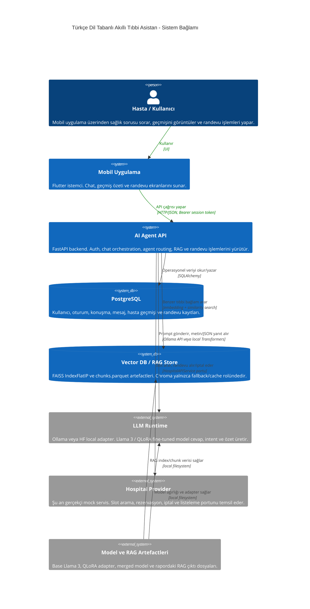
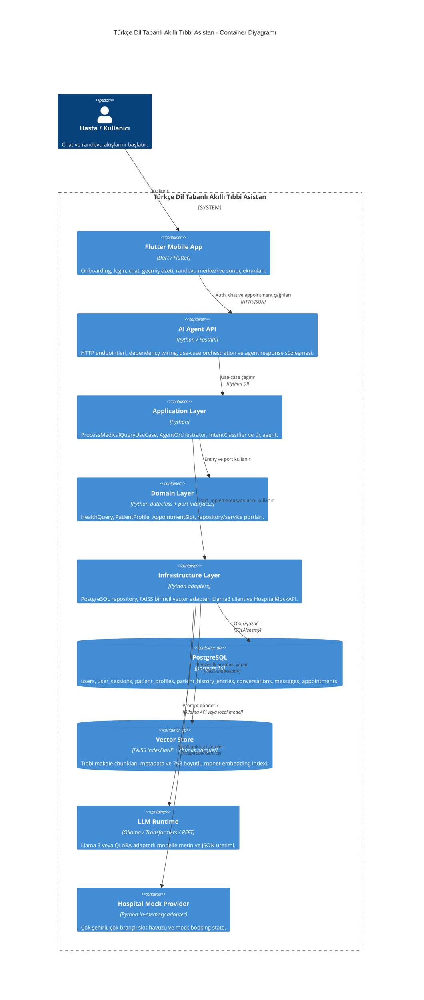
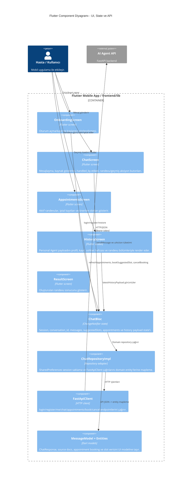
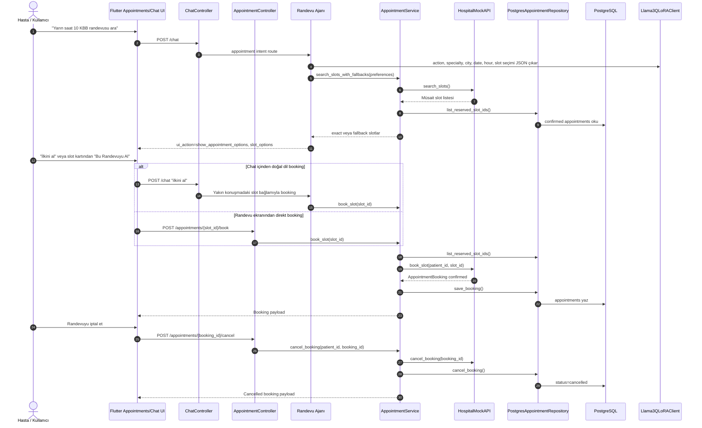
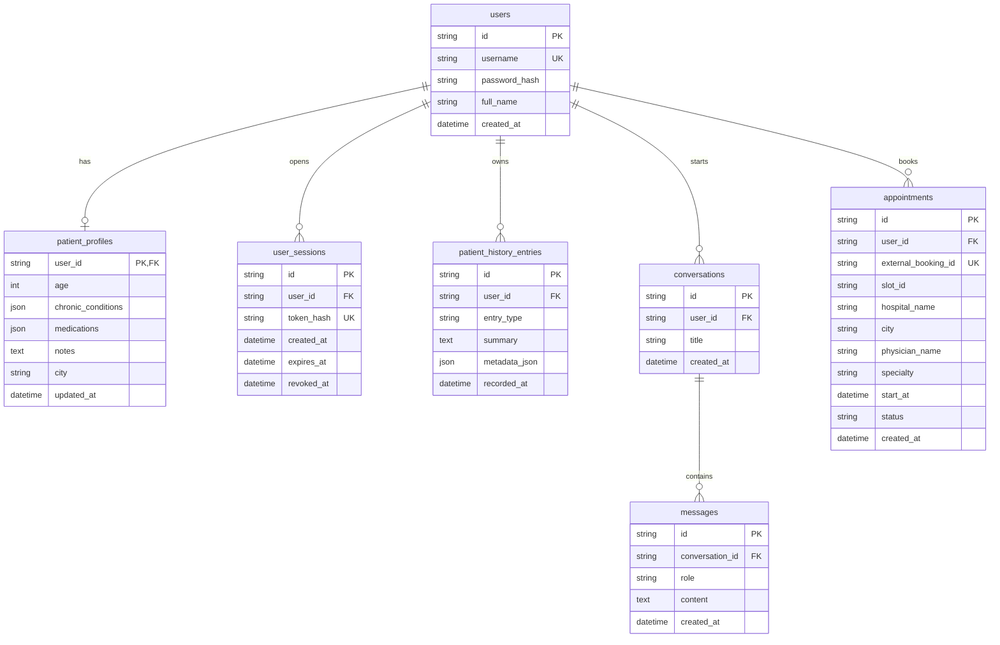
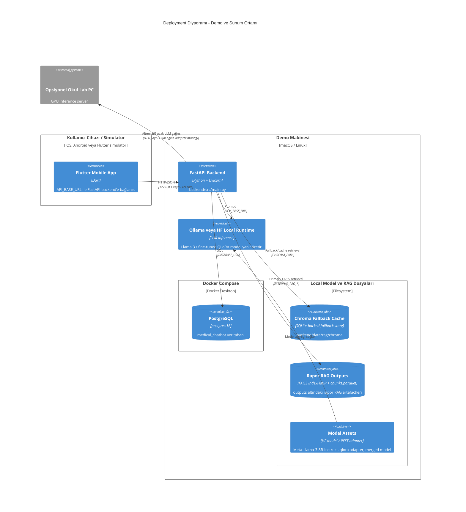

# C4 Mermaid Diyagramları

Bu doküman mevcut kod yapısına göre hazırlanmıştır. Diyagramlar `backend/src` ve `frontend/lib` altındaki gerçek sınıf, controller, agent ve repository bağlantılarını temel alır.

## 1. C4 Context Diagram



## 2. C4 Container Diagram



## 3. C4 Component Diagram - Backend

```mermaid
C4Component
    title Backend Component Diyagramı - FastAPI ve Agent Katmanı

    Container_Boundary(api, "AI Agent API / backend/src") {
        Component(auth_controller, "AuthController", "FastAPI router", "POST /auth/login, POST /auth/register, POST /auth/logout, GET /auth/me.")
        Component(chat_controller, "ChatController", "FastAPI router", "POST /chat ve GET /health endpointleri.")
        Component(appointment_controller, "AppointmentController", "FastAPI router", "GET /appointments, POST /appointments/search, book, cancel.")
        Component(dependencies, "Dependency Provider", "presentation/dependencies.py", "Repository, service, agent ve use-case nesnelerini bağlar.")

        Component(process_query, "ProcessMedicalQueryUseCase", "Application use-case", "Conversation oluşturur, HealthQuery üretir, orchestrator sonucu sonrası mesajları kaydeder.")
        Component(orchestrator, "AgentOrchestrator", "Application component", "Intent sonucuna göre Bilgi, Randevu veya Kişisel Geçmiş ajanına yönlendirir.")
        Component(intent, "IntentClassifier", "Rule + LLM classifier", "information, appointment, personal_history kararını verir.")

        Component(info_agent, "Bilgi Ajanı", "InformationAgent", "RAGService ile kaynak getirir, LLM ile Türkçe medikal bilgi cevabı üretir.")
        Component(appointment_agent, "Randevu Ajanı", "AppointmentAgent", "Tercih çıkarır, slot arar, rezervasyon/iptal/listeleme payloadı döner.")
        Component(personal_agent, "Kişisel Geçmiş Ajanı", "PersonalAgent", "Profil, klinik kayıt, randevu ve son mesajları özetler.")

        Component(rag_service, "RAGService", "Application service", "Vector sonuçlarını skor/kelime örtüşmesiyle yeniden sıralar ve filtreler.")
        Component(symptom_guidance, "SymptomGuidanceService", "Application service", "Semptomdan uzmanlık ipucu, alternatif bölüm ve kırmızı bayrak üretir.")
        Component(appointment_service, "AppointmentService", "Application service", "Slot arama fallbackleri, rezervasyon seçimi ve cancellation mantığı.")
        Component(auth_service, "AuthService", "Application service", "E-posta/şifre login, register, logout ve session doğrulama.")
    }

    ContainerDb(postgres, "PostgreSQL", "Operational DB", "Kullanıcı, oturum, profil, geçmiş, konuşma, mesaj ve randevu tabloları.")
    ContainerDb(vector_store, "Vector DB", "FAISS IndexFlatIP + chunks.parquet", "Tıbbi doküman chunkları ve metadata.")
    System_Ext(llm_runtime, "LLM Runtime", "Ollama / HF local / QLoRA", "Metin üretimi, yapılandırılmış JSON ve sohbet özeti.")
    System_Ext(hospital_provider, "Hospital Provider", "HospitalMockAPI", "Slot arama, book_slot, cancel_booking.")

    Rel(auth_controller, auth_service, "Kullanır")
    Rel(chat_controller, process_query, "Kullanır")
    Rel(appointment_controller, appointment_service, "Kullanır")
    Rel(dependencies, auth_controller, "Bağlar")
    Rel(dependencies, chat_controller, "Bağlar")
    Rel(dependencies, appointment_controller, "Bağlar")

    Rel(process_query, orchestrator, "process_query çağırır")
    Rel(process_query, postgres, "conversation + messages kaydeder", "PostgresUserHistoryRepository")
    Rel(orchestrator, intent, "Intent sınıflandırır")
    Rel(orchestrator, info_agent, "information intent")
    Rel(orchestrator, appointment_agent, "appointment intent")
    Rel(orchestrator, personal_agent, "personal_history intent")

    Rel(intent, llm_runtime, "Belirsiz intent için JSON ister")
    Rel(intent, postgres, "Yakın konuşma bağlamı okur")
    Rel(info_agent, rag_service, "retrieve")
    Rel(info_agent, symptom_guidance, "Semptom/branş ipucu")
    Rel(info_agent, llm_runtime, "Kaynaklı cevap üretir")
    Rel(rag_service, vector_store, "similarity_search")

    Rel(appointment_agent, appointment_service, "search/book/cancel/list")
    Rel(appointment_agent, symptom_guidance, "Semptomdan branş çıkarır")
    Rel(appointment_agent, llm_runtime, "Randevu parametresi JSON çıkarır")
    Rel(appointment_agent, postgres, "Son mesaj ve profil okur")
    Rel(appointment_service, hospital_provider, "Slot ve mock rezervasyon")
    Rel(appointment_service, postgres, "Kalıcı booking kaydı")

    Rel(personal_agent, postgres, "Profil, geçmiş, mesaj ve randevu okur")
    Rel(personal_agent, llm_runtime, "Kişisel özet ve konuşma özeti üretir")
```



## 4. C4 Component Diagram - Flutter



## 5. Dynamic Diagram - Chat Mesajı ve Agent Routing

```mermaid
sequenceDiagram
    autonumber
    actor Kullanici as Hasta / Kullanıcı
    participant Flutter as Flutter ChatScreen + ChatBloc
    participant API as ChatController POST /api/v1/chat
    participant Auth as get_current_user + AuthService
    participant UseCase as ProcessMedicalQueryUseCase
    participant HistoryRepo as PostgresUserHistoryRepository
    participant Orchestrator as AgentOrchestrator
    participant Intent as IntentClassifier
    participant Info as Bilgi Ajanı
    participant Appointment as Randevu Ajanı
    participant Personal as Kişisel Geçmiş Ajanı
    participant DB as PostgreSQL
    participant RAG as RAGService + Vector DB
    participant LLM as Llama3QLoRAClient

    Kullanici->>Flutter: Mesaj yazar
    Flutter->>API: POST /chat {message, conversation_id}
    API->>Auth: Bearer token doğrula
    Auth->>DB: user_sessions + users oku
    Auth-->>API: current_user
    API->>UseCase: execute(user_id, message, conversation_id)
    UseCase->>HistoryRepo: ensure_conversation()
    HistoryRepo->>DB: conversations oku/yaz
    UseCase->>Orchestrator: process_query(HealthQuery)
    Orchestrator->>Intent: classify(query)
    Intent->>DB: Gerekirse son mesajları oku
    Intent->>LLM: Belirsiz durumda intent JSON iste
    LLM-->>Intent: {intent, reason, confidence}

    alt information
        Orchestrator->>Info: answer_medical_query()
        Info->>RAG: retrieve(query, k=3)
        RAG->>RAG: FAISS IndexFlatIP ile top-k ara; gerekirse fallback skorla
        Info->>LLM: Kaynak ve semptom ipucuyla cevap üret
        LLM-->>Info: Türkçe bilgi cevabı
        Info-->>Orchestrator: message + sources + payload
    else appointment
        Orchestrator->>Appointment: handle_appointment_request()
        Appointment->>DB: Profil ve son konuşma bağlamı oku
        Appointment->>LLM: Randevu parametrelerini JSON çıkar
        Appointment-->>Orchestrator: slot/booking payloadı
    else personal_history
        Orchestrator->>Personal: handle_history_query()
        Personal->>DB: Profil, history_entries, messages, appointments oku
        Personal->>LLM: Yakın konuşma ve kayıt özeti üret
        Personal-->>Orchestrator: history summary payloadı
    end

    Orchestrator-->>UseCase: Standart ChatResponse alanları
    UseCase->>HistoryRepo: save_interaction(user + assistant)
    HistoryRepo->>DB: messages + interaction history yaz
    API-->>Flutter: ChatResponse
    Flutter->>Flutter: ui_action'a göre kaynak/randevu/geçmiş göster
```

## 6. Dynamic Diagram - Randevu Arama, Alma ve İptal



## 7. Data / ER Diagram



## 8. Deployment Diagram



## 9. Koddan Çıkan Mimari Notlar

- `frontend/lib/data/datasources/remote/fastapi_client.dart` HTTP sınırıdır; `/auth`, `/chat` ve `/appointments` endpointlerini tüketir.
- `frontend/lib/presentation/blocs/chat_bloc.dart` mobil state merkezidir; `conversationId`, `suggestedSlots`, `appointments` ve `latestHistoryPayload` burada tutulur.
- `backend/src/presentation/dependencies.py` backend dependency graph merkezidir; agent, service, repository ve LLM adapter burada bağlanır.
- `backend/src/application/use_cases/process_medical_query.py` conversation oluşturma, orchestrator çağırma ve mesajları DB'ye kaydetme akışının ana use-case'idir.
- `backend/src/application/orchestrator/agent_orchestrator.py` tek agent routing noktasıdır.
- `backend/src/application/services/intent_classifier.py` önce rule-based karar verir, belirsiz durumda LLM'den yapılandırılmış intent JSON'u ister.
- `backend/src/application/agents/information_agent.py` RAG + LLM + semptom rehberiyle Bilgi Ajanı davranışını üretir.
- `backend/src/application/agents/appointment_agent.py` randevu parametre çıkarımı, slot listeleme, booking, cancel ve list akışını yönetir.
- `backend/src/application/agents/personal_agent.py` profil, geçmiş kayıt, randevu ve son mesajları kullanarak kişisel özet üretir.
- `backend/src/infrastructure/database/postgres/models.py` operasyonel veritabanı şemasının kaynağıdır.
- `backend/src/infrastructure/database/vector/faiss_chroma_db.py` rapordaki RAG artefactleri, Chroma store ve fallback retrieval davranışının adapterıdır.
- `backend/src/infrastructure/ai/llama3_qlora_client.py` plain Ollama, HF local ve HF adapter modlarını aynı `LLMEngine` portu arkasında toplar.
